# LAB6
# LAB 6 — Analyse statique d'un APK avec MobSF
### Cours : Sécurité des applications mobiles | Plateforme : MLIAEdu

---

## 📋 Informations générales

| Champ | Valeur |
|-------|--------|
| **Date** | 2026-05-14 |
| **Analyste** | Amine Floulou |
| **Fichier APK** | app-debug.apk |
| **SHA-256** | *dd7c1932f506ea626622325fa5a041f4061aa8ff9cbf1454a58cc7f233efc4a6* |
| **Nom du package** | ma.ens.myapplication |
| **Nom de l'application** | My Application |
| **Version de l'application** | 1.0 (code : 1) |
| **SDK cible** | 36 (Android 16) |
| **SDK minimum** | 24 (Android 7.0) |
| **Activité principale** | ma.ens.myapplication.MainActivity |
| **Outils utilisés** | MobSF dans la VM Mobexler |

---


---

## 1. Préparation de l'environnement

**Objectif :** Créer un espace de travail organisé et traçable avant de toucher à tout outil de sécurité.
Dans un audit professionnel, la traçabilité prouve *ce qui* a été analysé, *quand*, et que le fichier n'a pas été altéré.

**Commandes exécutées :**
```bash
mkdir -p ~/apk_analysis/$(date +%Y-%m-%d)
cd ~/apk_analysis/$(date +%Y-%m-%d)
mv ~/Downloads/app-debug.apk ./
sha256sum app-debug.apk | tee apk_hash.txt
echo "=== TRAÇABILITÉ DE L'ANALYSE ===" > analyse_info.txt
echo "Date : $(date)" >> analyse_info.txt
echo "Analyste : Abdessamad Adansar" >> analyse_info.txt
echo "Fichier APK : app-debug.apk" >> analyse_info.txt
cat apk_hash.txt >> analyse_info.txt
```

**Qu'est-ce qu'un hash SHA-256 ?**
Un hash SHA-256 est une empreinte unique de 64 caractères associée à un fichier. Si un seul octet change, le hash change complètement. Cela prouve que l'on a analysé exactement ce fichier — important dans un contexte légal et professionnel.

**Captures d'écran — Dossier de travail et hash de l'APK :**

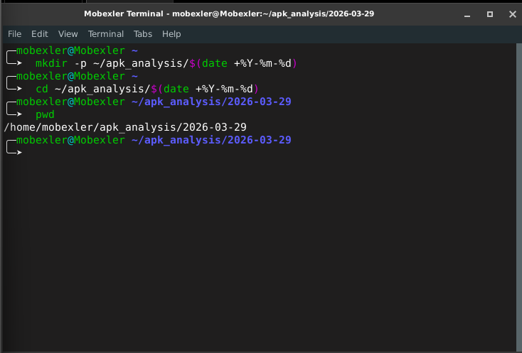
*Terminal montrant le dossier de travail daté créé avec la sortie de pwd*

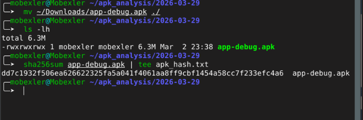
*Terminal montrant l'APK listé avec son hash SHA-256*

---

## 2. Lancement de MobSF

**Objectif :** Démarrer MobSF et vérifier que l'interface web est accessible.

**Qu'est-ce que MobSF ?**
MobSF (Mobile Security Framework) est un scanner de sécurité automatisé open-source pour les applications mobiles. Il fonctionne comme un serveur web local à l'intérieur de la VM — rien ne sort de l'environnement isolé. Il effectue plus de 100 vérifications de sécurité automatiquement, un travail qui prendrait des heures à un analyste humain.

**Commandes exécutées :**
```bash
cd ~/tools/Mobile-Security-Framework-MobSF
./run.sh 127.0.0.1:8000
```

**Qu'est-ce que 127.0.0.1 ?**
C'est ce qu'on appelle le *localhost* — cela signifie « cette machine elle-même ». Le port 8000 est celui sur lequel MobSF écoute. Personne en dehors de la VM ne peut y accéder.

> **Note :** Le terminal MobSF doit rester ouvert pendant tout le lab. Le fermer arrête le serveur.

**Version de MobSF notée dans le fichier de traçabilité :**
```bash
echo "Version MobSF : [version]" >> ~/apk_analysis/$(date +%Y-%m-%d)/analyse_info.txt
```

**Captures d'écran — MobSF en cours d'exécution :**

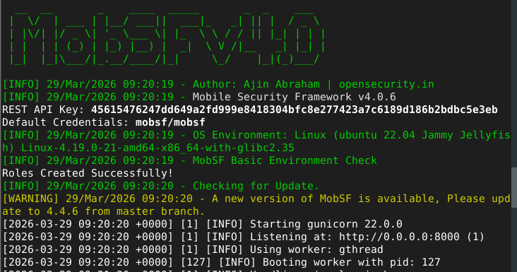
*Terminal montrant le serveur MobSF en cours d'exécution avec le message "Server is running"*

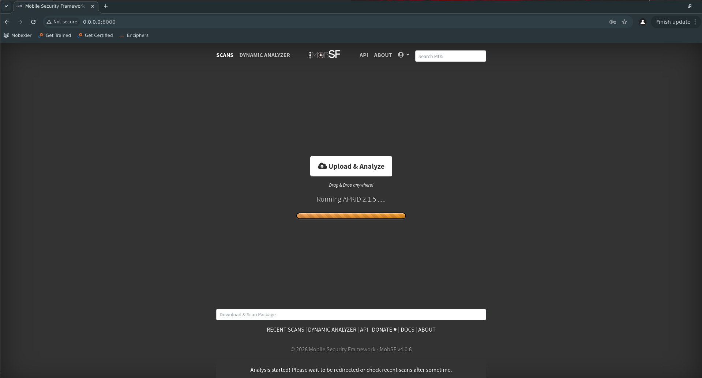
*Firefox affichant la page d'accueil MobSF avec l'interface d'upload*

---

## 3. Import et analyse de l'APK

**Objectif :** Soumettre l'APK à MobSF pour une analyse statique complète.

**Qu'est-ce que l'analyse statique ?**
L'analyse statique consiste à examiner le code et les ressources de l'application *sans l'exécuter*. MobSF décompile l'APK — il inverse le binaire compilé pour le rendre lisible — puis analyse automatiquement les problèmes de sécurité.

**Étapes effectuées :**
- Clic sur **Upload & Analyze** dans l'interface MobSF
- Sélection de `app-debug.apk` depuis le dossier de travail
- Attente de la fin de l'analyse (barre de progression visible)
- Notation du score de sécurité global

**Commandes pour la traçabilité :**
```bash
echo "Début de l'analyse : $(date)" >> ~/apk_analysis/$(date +%Y-%m-%d)/analyse_info.txt
echo "Score de sécurité : [score]" >> ~/apk_analysis/$(date +%Y-%m-%d)/analyse_info.txt
```

**Capture d'écran — Tableau de bord des résultats MobSF :**

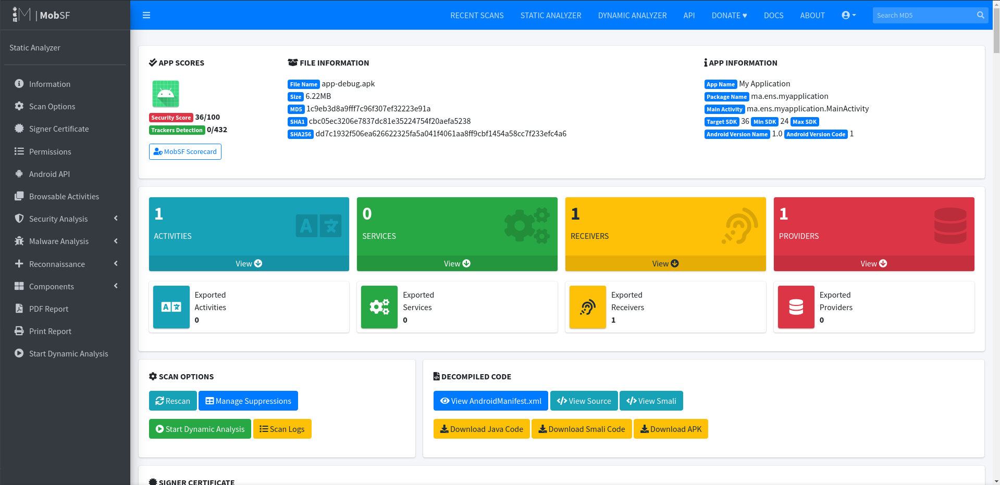
*Tableau de bord MobSF montrant le score de sécurité global et les catégories de résultats (Info / Warning / High / Critical)*

---

## 4. Analyse du manifeste et des permissions

**Objectif :** Examiner le fichier AndroidManifest.xml et identifier les mauvaises configurations de sécurité.

**Qu'est-ce que le fichier AndroidManifest.xml ?**
C'est la carte d'identité de toute application Android. Il déclare ce que l'application a le droit de faire (permissions), quels composants elle possède, et comment elle est configurée. Les mauvaises configurations ici exposent directement les utilisateurs à des attaques.

**Concepts clés :**
- **Permissions dangereuses** — accès aux données sensibles de l'utilisateur (caméra, localisation, contacts). Doivent être explicitement accordées par l'utilisateur
- **Permissions normales** — faible risque, accordées automatiquement (accès internet, état du réseau)
- **Composants exportés** — composants accessibles depuis d'autres applications sur l'appareil. Dangereux s'ils ne sont pas protégés
- **debuggable=true** — permet à tout attaquant ayant accès ADB d'attacher un débogueur à l'application en cours d'exécution
- **allowBackup=true** — permet l'extraction complète des données de l'application via USB sans accès root

---

### 4.1 Informations de base de l'application

| Champ | Valeur |
|-------|--------|
| Nom de l'application | My Application |
| Nom du package | ma.ens.myapplication |
| Activité principale | ma.ens.myapplication.MainActivity |
| SDK cible | 36 |
| SDK minimum | 24 |
| Nom de version Android | 1.0 |
| Code de version Android | 1 |

**Capture d'écran — Section App Information :**

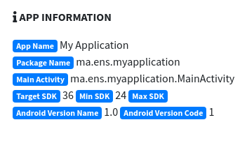
*Onglet App Information de MobSF montrant le nom du package, les versions SDK, debuggable et allowBackup*

---

### 4.2 Problèmes de sécurité du manifeste

| N° | Problème | Sévérité | Description |
|----|----------|----------|-------------|
| 1 | `android:debuggable=true` | 🔴 ÉLEVÉE | Débogage activé — permet l'attachement d'un débogueur, le dump mémoire et l'accès aux traces de pile |
| 2 | `minSdkVersion=24` (Android 7.0) | 🔴 ÉLEVÉE | L'application peut être installée sur des appareils avec de nombreuses vulnérabilités non corrigées |
| 3 | `android:allowBackup=true` | 🟡 AVERTISSEMENT | Les données de l'application peuvent être extraites via ADB par quiconque disposant d'un accès au débogage USB |
| 4 | FragmentReceiver exporté avec permission DUMP | 🟡 AVERTISSEMENT | Le niveau de protection de la permission doit être vérifié — si normal ou dangereux, toute application peut la demander |

**Capture d'écran — Analyse du manifeste :**

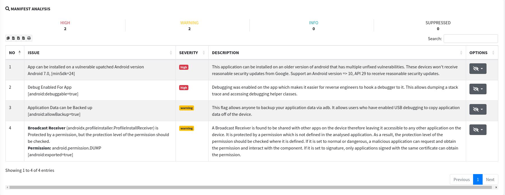
*Onglet Manifest Analysis de MobSF montrant tous les avertissements de sécurité avec leur code couleur de sévérité*

---

### 4.3 Permissions

| Permission | Type | Risque |
|------------|------|--------|
| `ma.ens.myapplication.DYNAMIC_RECEIVER_NOT_EXPORTED_PERMISSION` | Personnalisée / Inconnue | Faible — usage interne |

> **Aucune permission Android dangereuse standard trouvée** (pas de CAMERA, ACCESS_FINE_LOCATION, READ_CONTACTS, etc.). C'est un résultat positif pour une application prototype minimale.

**Capture d'écran — Section des permissions :**

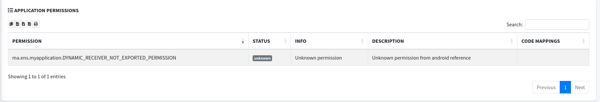
*Section des permissions MobSF montrant l'absence de permissions dangereuses standard*

---

### 4.4 Composants exportés

| Type | Composant | Exporté | Protection |
|------|-----------|---------|------------|
| Receiver | android.profileinstaller.ProfileInstallReceiver | ✅ Oui | ❌ Aucune |
| Provider | android.startup.InitializationProvider | ✅ Oui | ❌ Aucune |
| Receiver | androidx.profileinstaller.FragmentReceiver | ✅ Oui | ⚠️ android.permission.DUMP (non définie dans l'app) |

> **Note :** Les trois composants exportés appartiennent aux bibliothèques AndroidX/Jetpack injectées automatiquement par le système de build — pas du code applicatif personnalisé. Voir la section Faux positifs.

**Capture d'écran — Composants exportés :**

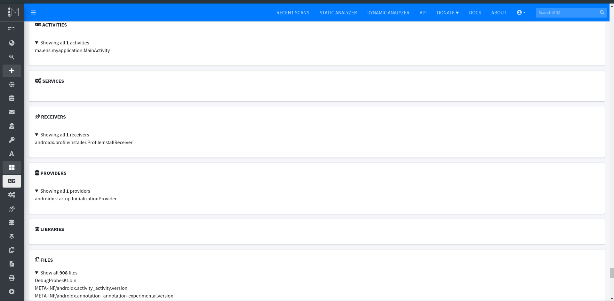
*MobSF affichant les composants exportés avec leur statut de protection*

---

## 5. Analyse de la configuration réseau

**Objectif :** Examiner comment l'application communique sur le réseau et si les données sont chiffrées.

**Qu'est-ce qu'une attaque Man-in-the-Middle (MitM) ?**
Si une application envoie des données en HTTP (texte clair) plutôt qu'en HTTPS (chiffré), toute personne sur le même réseau WiFi peut intercepter et lire tout le trafic — mots de passe, tokens, données personnelles. C'est une attaque MitM.

**Résultats :**

| Vérification | Résultat | Interprétation |
|--------------|----------|----------------|
| `android:usesCleartextTraffic` | Absent | ✅ Trafic HTTP bloqué par défaut |
| `network_security_config.xml` | Non trouvé | ✅ La politique sécurisée par défaut d'Android s'applique |
| URLs codées en dur | Aucune trouvée | ✅ Aucun endpoint exposé ni IP interne |

**Conclusion :**
Aucune mauvaise configuration de sécurité réseau n'a été identifiée. L'absence de `usesCleartextTraffic` et de `network_security_config.xml` indique que l'application s'appuie sur la politique réseau sécurisée par défaut d'Android, appropriée et suffisante pour le SDK cible 36. Sur l'API 36, Android bloque automatiquement tout trafic HTTP en clair sauf autorisation explicite.

> Il s'agit d'une zone conforme — aucune action requise.

---

## 6. Analyse du code et des ressources

**Objectif :** Rechercher des secrets codés en dur, des patterns de code vulnérables et des ressources sensibles.

**Qu'est-ce qu'un secret codé en dur ?**
Quand un développeur écrit des données sensibles directement dans le code source — comme `String apiKey = "abc123secret"` — toute personne qui décompile l'APK (ce qui prend environ 30 secondes avec des outils gratuits) peut le lire instantanément.

**Résultats :**

| Catégorie | Résultat | Notes |
|-----------|----------|-------|
| Clés API codées en dur | Aucune trouvée | ✅ Propre |
| Mots de passe / tokens codés en dur | Aucun trouvé | ✅ Propre |
| URLs sensibles dans le code | Aucune trouvée | ✅ Propre |
| Patterns de code dangereux | Aucun trouvé | ✅ Propre |
| Fichiers de ressources sensibles | Aucun trouvé | ✅ Propre |

**Conclusion :**
L'application semble être un prototype minimal avec des fonctionnalités très limitées. La petite base de code entraîne une surface d'attaque réduite — il n'y a tout simplement pas assez de code pour introduire des vulnérabilités complexes. Cela est cohérent avec une application de type « Hello World ».

> Aucun secret codé en dur ni pattern de code vulnérable trouvé. C'est un résultat positif.

---

## 7. Corrélation OWASP MASVS

**Objectif :** Associer toutes les découvertes au standard international OWASP MASVS.

**Qu'est-ce que l'OWASP MASVS ?**
Le Mobile Application Security Verification Standard est un cadre mondialement reconnu qui définit les exigences de sécurité pour les applications mobiles. L'utiliser donne à chaque découverte une référence standard que tout professionnel de la sécurité dans le monde comprendra immédiatement.

**Qu'est-ce que l'OWASP MASTG ?**
Le Mobile Application Security Testing Guide est le document complémentaire au MASVS. Il fournit des procédures de test détaillées étape par étape pour vérifier chaque exigence.

**Captures d'écran — Sites OWASP :**

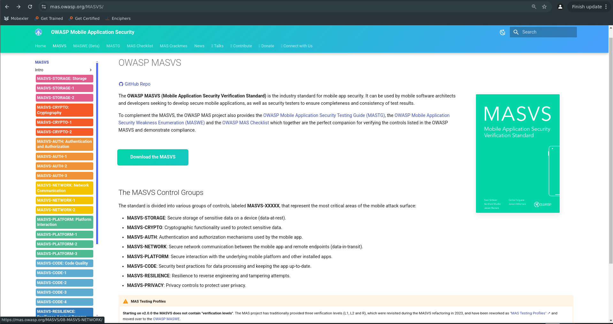
*Site web OWASP MASVS montrant les catégories du standard*

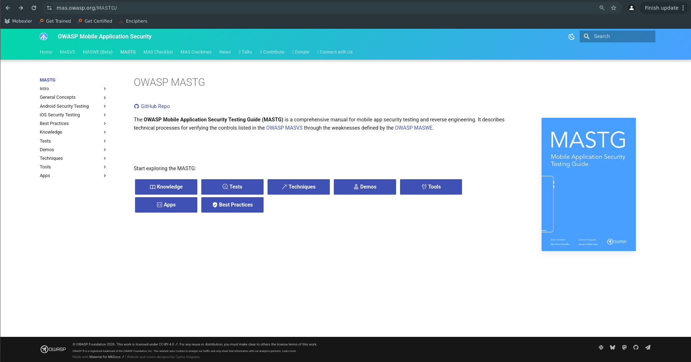
*Site web OWASP MASTG montrant la structure du guide de test*

---

### Tableau de corrélation MASVS

| Découverte | Référence MASVS | Catégorie | Statut |
|------------|-----------------|-----------|--------|
| `android:debuggable=true` | MASVS-RESILIENCE-4 | Résilience | ❌ Non conforme |
| `minSdkVersion=24` | MASVS-CODE-1 | Qualité du code | ❌ Non conforme |
| `android:allowBackup=true` | MASVS-STORAGE-8 | Stockage | ❌ Non conforme |
| Communication réseau | MASVS-NETWORK-1 | Réseau | ✅ Conforme |
| Pas de permissions dangereuses | MASVS-PLATFORM-1 | Plateforme | ✅ Conforme |
| Pas de secrets codés en dur | MASVS-STORAGE-2 | Stockage | ✅ Conforme |

---

### Correspondance MASVS détaillée

**MASVS-RESILIENCE-4 — debuggable=true**
> *« L'application n'est pas déboguable en mode release. »*
- **Preuve :** `android:debuggable="true"` dans AndroidManifest.xml
- **Impact :** Un attaquant peut attacher un débogueur, dumper la mémoire d'exécution, extraire clés et tokens, contourner la logique d'authentification
- **Test MASTG :** MASTG-TEST-0039

**MASVS-CODE-1 — minSdk=24**
> *« L'application est construite avec des outils à jour et cible un niveau d'API récent. »*
- **Preuve :** `android:minSdkVersion="24"` — Android 7.0, sorti en 2016
- **Impact :** L'application fonctionne sur des appareils avec des années de vulnérabilités OS non corrigées
- **Test MASTG :** MASTG-TEST-0003

**MASVS-STORAGE-8 — allowBackup=true**
> *« L'application empêche la sauvegarde des données applicatives sensibles. »*
- **Preuve :** `android:allowBackup="true"` dans AndroidManifest.xml
- **Impact :** Données complètes extractibles via `adb backup` sans accès root
- **Test MASTG :** MASTG-TEST-0010

---

## 8. Exportation du rapport et triage

**Objectif :** Exporter le rapport officiel MobSF et effectuer un triage professionnel de toutes les découvertes.

**Qu'est-ce que le triage ?**
Le triage vient de la terminologie médicale — tout comme les médecins priorisent les patients par gravité, les analystes en sécurité priorisent les vulnérabilités selon leur risque réel. Toutes les alertes automatisées ne nécessitent pas une action immédiate. Un analyste professionnel filtre, contextualise et priorise toujours avant de rédiger son rapport.

**Commandes exécutées :**
```bash
mv ~/Downloads/MobSF_Report*.pdf ~/apk_analysis/$(date +%Y-%m-%d)/MobSF_Report_$(date +%Y%m%d).pdf
ls -lh ~/apk_analysis/$(date +%Y-%m-%d)/
```

**Capture d'écran — Rapport PDF MobSF exporté :**

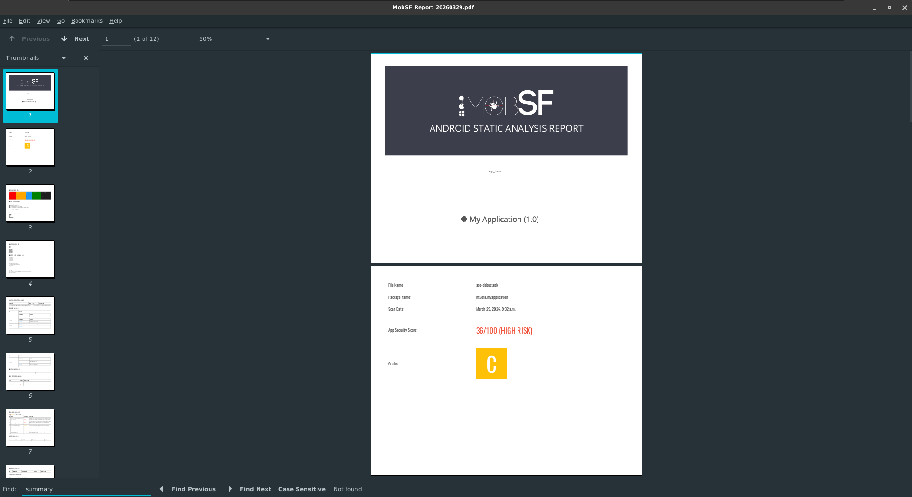
*Le rapport PDF MobSF exporté ouvert montrant la première page et la structure du rapport*

**Capture d'écran — Tous les fichiers produits :**

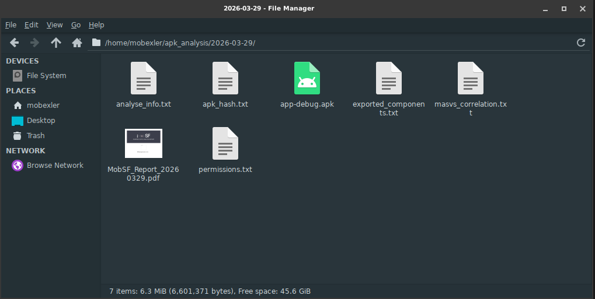
*Terminal ls -lh montrant tous les fichiers produits pendant l'analyse*

**Capture d'écran — Fichier de traçabilité :**

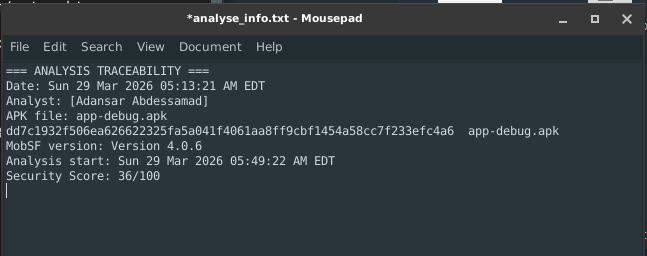
*Terminal cat analyse_info.txt montrant le registre de traçabilité complet*

---

## 9. Résumé exécutif

L'analyse statique de `app-debug.apk` (package : `ma.ens.myapplication`) a été réalisée avec MobSF dans la VM Mobexler. L'application est un prototype Android minimal avec des fonctionnalités limitées.

Trois découvertes de sécurité confirmées ont été identifiées — deux évaluées à sévérité Élevée et une Avertissement — toutes situées dans la configuration AndroidManifest.xml. Aucun secret codé en dur, permission dangereuse ou mauvaise configuration réseau n'a été trouvé, représentant une base saine pour ces domaines.

La découverte la plus critique est le débogage activé dans ce qui semble être un build de débogage soumis à l'analyse. Dans une release de production, cela permettrait à un attaquant disposant d'un accès physique ou ADB d'inspecter entièrement la mémoire d'exécution, d'extraire des identifiants et de contourner la logique applicative.

Deux alertes MobSF concernant des composants exportés de bibliothèques AndroidX ont été classées comme faux positifs — il s'agit d'un comportement standard des bibliothèques Google et ne représentent pas une surface d'attaque exploitable.

**Niveau de risque global : 🟡 MOYEN**
*(Découvertes de sévérité élevée présentes mais surface d'attaque limitée due aux fonctionnalités minimales de l'application)*

---

## 10. Vulnérabilités confirmées

---

### 🔴 Vulnérabilité 1 — Débogage activé dans le build de production

| Champ | Détail |
|-------|--------|
| **Sévérité** | ÉLEVÉE |
| **Référence MASVS** | MASVS-RESILIENCE-4 |
| **Test MASTG** | MASTG-TEST-0039 |
| **Localisation** | AndroidManifest.xml |
| **Preuve** | `android:debuggable="true"` |

**Description :**
L'application a le débogage explicitement activé. Cela permet à tout attaquant disposant d'un accès physique ou d'une connectivité ADB d'attacher un débogueur au processus en cours d'exécution en temps réel.

**Impact réel :**
- Extraire les clés de chiffrement, tokens d'authentification et variables sensibles depuis la mémoire
- Lire toutes les données de l'application à l'exécution
- Parcourir la logique d'authentification pas à pas et la contourner
- Dumper la totalité de la pile d'appels et du contenu mémoire

**Remédiation :**
Supprimer `android:debuggable="true"` du manifeste. Dans un projet Gradle, les builds de release le définissent automatiquement à false — la correction consiste simplement à ne jamais le surcharger manuellement à true. Ne jamais livrer un APK de production avec ce flag activé.

```xml
<!-- SUPPRIMER cette ligne de AndroidManifest.xml -->
android:debuggable="true"
```

---

### 🔴 Vulnérabilité 2 — SDK minimum permettant des appareils non corrigés

| Champ | Détail |
|-------|--------|
| **Sévérité** | ÉLEVÉE |
| **Référence MASVS** | MASVS-CODE-1 |
| **Test MASTG** | MASTG-TEST-0003 |
| **Localisation** | AndroidManifest.xml |
| **Preuve** | `android:minSdkVersion="24"` |

**Description :**
L'application supporte Android 7.0 (API 24) sorti en 2016. Les appareils sous Android 7.0 n'ont pas reçu de correctifs de sécurité de Google depuis des années et contiennent de nombreuses vulnérabilités connues et publiquement documentées.

**Impact réel :**
- L'application peut être installée sur des appareils avec des vulnérabilités OS non corrigées
- Les attaquants peuvent exploiter des CVE connus contre le système Android sous-jacent
- Les utilisateurs sur anciens appareils ne bénéficient pas des améliorations de sécurité de la plateforme

**Remédiation :**
Augmenter `minSdkVersion` à 29 (Android 10) au minimum. Cela garantit que chaque appareil pouvant installer l'application reçoit des mises à jour de sécurité raisonnables.

```xml
<!-- Dans build.gradle -->
minSdkVersion 29
```

---

### 🟡 Vulnérabilité 3 — Sauvegarde de l'application activée

| Champ | Détail |
|-------|--------|
| **Sévérité** | AVERTISSEMENT |
| **Référence MASVS** | MASVS-STORAGE-8 |
| **Test MASTG** | MASTG-TEST-0010 |
| **Localisation** | AndroidManifest.xml |
| **Preuve** | `android:allowBackup="true"` |

**Description :**
L'application autorise la sauvegarde complète des données via ADB. Toute personne disposant d'un câble USB et du débogage USB activé sur l'appareil cible peut extraire le répertoire complet des données de l'application sans accès root.

**Impact réel :**
- Bases de données, préférences partagées, tokens d'authentification tous extractibles
- Aucun accès root requis — seulement le débogage USB
- Commande d'attaque : `adb backup ma.ens.myapplication`

**Remédiation :**
Définir `android:allowBackup="false"` dans AndroidManifest.xml. Si une sauvegarde sélective est requise pour les données utilisateur, l'implémenter via l'API Android BackupAgent avec des règles d'exclusion explicites.

```xml
<!-- Dans AndroidManifest.xml -->
android:allowBackup="false"
```

---

## 11. Faux positifs

Les alertes MobSF suivantes ont été investiguées et classées comme faux positifs :

| Composant | Alerte MobSF | Classification | Raison |
|-----------|--------------|----------------|--------|
| `ProfileInstallReceiver` | Receiver exporté, pas de permission | ⚪ Faux positif | Bibliothèque AndroidX Jetpack — injectée automatiquement par le système de build, pas du code personnalisé |
| `InitializationProvider` | Provider exporté, pas de permission | ⚪ Faux positif | Bibliothèque AndroidX startup — comportement standard et attendu |
| `FragmentReceiver` | Protégé par la permission DUMP | ⚪ Faux positif | Permission système non accessible aux applications tierces normales |

**Explication :**
Ces composants font partie des bibliothèques AndroidX/Jetpack de Google et sont injectés dans tout projet Android utilisant ces dépendances. Ils ne sont pas écrits par le développeur et ne représentent pas de la logique applicative personnalisée. Leur statut exporté est intentionnel et contrôlé par Google. Ils ne constituent pas une surface d'attaque exploitable dans ce contexte.

C'est un exemple classique de la raison pour laquelle **l'analyse automatisée doit toujours être vérifiée par un analyste humain** — l'outil ne peut pas distinguer le code de bibliothèque du code applicatif.

---

## 12. Zones conformes

| Domaine | Référence MASVS | Statut | Notes |
|---------|-----------------|--------|-------|
| Communication réseau | MASVS-NETWORK-1 | ✅ Conforme | Politique sécurisée par défaut d'Android appliquée, HTTP bloqué |
| Permissions dangereuses | MASVS-PLATFORM-1 | ✅ Conforme | Aucune permission dangereuse demandée |
| Secrets codés en dur | MASVS-STORAGE-2 | ✅ Conforme | Aucune clé API, token ou identifiant trouvé |
| Endpoints exposés | MASVS-NETWORK-1 | ✅ Conforme | Aucune URL codée en dur ni IP interne |
| Trafic en clair | MASVS-NETWORK-1 | ✅ Conforme | usesCleartextTraffic absent |

---

## 13. Recommandations priorisées

### Priorité 1 — Corriger immédiatement (avant toute mise en production)
**Désactiver le débogage**
Supprimer `android:debuggable="true"` de AndroidManifest.xml. C'est la découverte à risque le plus élevé de ce rapport et la correction la plus simple. Les builds de release dans Gradle gèrent cela automatiquement — le développeur ne doit simplement pas le surcharger manuellement.

### Priorité 2 — Corriger avant la mise en production
**Désactiver la sauvegarde**
Définir `android:allowBackup="false"` dans AndroidManifest.xml. Cela empêche l'extraction non autorisée des données de l'application via USB sans aucun impact sur les fonctionnalités normales de l'application.

### Priorité 3 — Planifier pour le prochain cycle de développement
**Augmenter le SDK minimum**
Mettre à jour `minSdkVersion` de 24 à 29 dans build.gradle. Cela garantit que tous les appareils supportés reçoivent les correctifs de sécurité Google. Évaluer l'impact sur la base d'utilisateurs actuelle avant d'appliquer ce changement.

---


---

## 📸 Index des captures d'écran

| N° | Nom du fichier | Tâche | Contenu |
|----|----------------|-------|---------|
| 1 | `images/01_working_folder.png` | Tâche 1 | Dossier de travail daté créé dans le terminal |
| 2 | `images/02_apk_hash.png` | Tâche 1 | APK listé avec son hash SHA-256 |
| 3 | `images/03_mobsf_terminal.png` | Tâche 2 | Serveur MobSF en cours d'exécution dans le terminal |
| 4 | `images/04_mobsf_interface.png` | Tâche 2 | Interface web MobSF dans Firefox |
| 5 | `images/05_mobsf_score.png` | Tâche 3 | Tableau de bord des résultats MobSF et score de sécurité |
| 6 | `images/06_app_information.png` | Tâche 4 | Onglet App Information — SDK, package, flags |
| 7 | `images/07_manifest_analysis.png` | Tâche 4 | Liste des avertissements de l'analyse du manifeste |
| 8 | `images/08_permissions.png` | Tâche 4 | Section des permissions |
| 9 | `images/09_exported_components.png` | Tâche 4 | Détail des composants exportés |
| 10 | `images/10_masvs_website.png` | Tâche 7 | Site web OWASP MASVS |
| 11 | `images/11_mastg_website.png` | Tâche 7 | Site web OWASP MASTG |
| 12 | `images/12_mobsf_pdf.png` | Tâche 8 | Rapport PDF MobSF exporté |
| 13 | `images/13_all_files.png` | Tâche 8 | Tous les fichiers produits dans le dossier de travail |
| 14 | `images/14_analyse_info.png` | Tâche 8 | Contenu complet du fichier de traçabilité |

---

*Rapport produit dans le cadre du LAB 6 — Analyse statique d'un APK avec MobSF*
*Cours : Sécurité des applications mobiles | Plateforme MLIAEdu*
*Analyste : Amine Floulou | Date : 2026-05-14*
